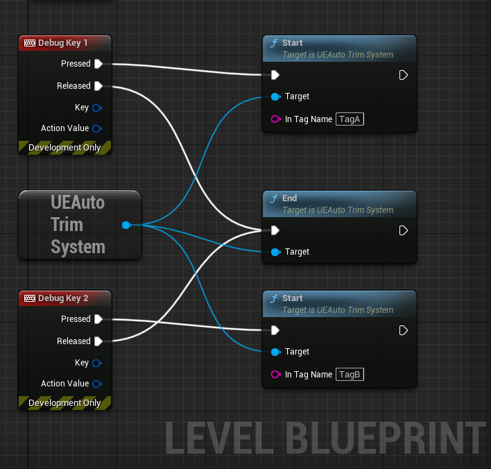

[日本語版](./README_JP.md)
# Overview
A tools for UnrealEngine that automatically trims captured video.

This tool implements the tags displayed in the upper left corner of the screen and clips the video based on the tags.

## Use Case
- Trimming a player's special skill from a captured video
- Trimming the location where the player is killed by the enemy from the captured video


## Demo
Source video.

https://user-images.githubusercontent.com/103555/233125625-2da462e4-ccc7-4699-991a-c5109564143c.mp4

One of the clipped videos.

https://user-images.githubusercontent.com/103555/233129023-53fa03ed-24f2-4305-9f50-db08587ddc01.mp4

# How to use

1. Implement trimming tag to game  
2. Play the game and capture the video  
3. Analyze the captured video

## 1. Implement trimming tag to game
### 1-1. Add the plugin to unreal engine project
Copy the [UEAutoTrim plugin folder](./Plugins/UEAutoTrim/) to the project's plugin folder.  
Then, enable the plugin in the project.

### 1-2. Implement displaying tag in game

Display the tag in the game by calling the following function through the UEAutoTrimSystem subsystem.  

| Function | Description |
|:-|:-|
|Start|Displays the clip start tag.|
|End|Displays the clip end tag.|

For Example



There are also functions to set the display position and color of tags. Please check [UEAutoTrimSystem.h](./Plugins/UEAutoTrim/Source/UEAutoTrim/Public/UEAutoTrimSystem.h) for details.

## 2. Play the game and capture the video
Play the game and capture the video with capturing software. (eg. windows game bar)

## 3. Analyze the captured video
### 3-1. Build Docker image
```
docker buildx build -t ue-auto-trim:1.0 .
```

Recommend to use Docker to avoid development environmental problems.  
If you want to use without Docker, reference [Dockerfile](./Dockerfile) to setup environment.

### 3-2.Run
```
docker run --rm -it  --gpus=all -v {path_to_videodata_dir}:/usr/work:rw  ue-auto-trim:1.0 --video /usr/work/sample.mp4 --dist /usr/work --prefix sample_
```
| Argument | Description |
|:-|:-|
| --video | video file path |
| --dist | path to the directory where trimmed files will be saved. |
| --prefix | trim file prefix |
| --detect_frame_scale_x | set the detection scale for the frame's width. 0..1 |
| --detect_frame_scale_y | set the detection scale for the frame's height. 0..1 |
| --trim_offset_sec | set the offset time in seconds from the tag to determine the start and end trimming position. |

**NVIDIA Container Toolkit is required to use GPU with container**  
Check the following URL for installation.  
https://docs.nvidia.com/datacenter/cloud-native/container-toolkit/install-guide.html#docker


**Use Sample Video**  
This repository contains sample video.  
You can try to trim the video with the following command.

```
cd ue-auto-trim
docker run --rm -it  --gpus=all -v $(pwd)/sampledata:/usr/work:rw ue-auto-trim:1.0 --video /usr/work/sample.mp4 --dist /usr/work --prefix sample_
```
