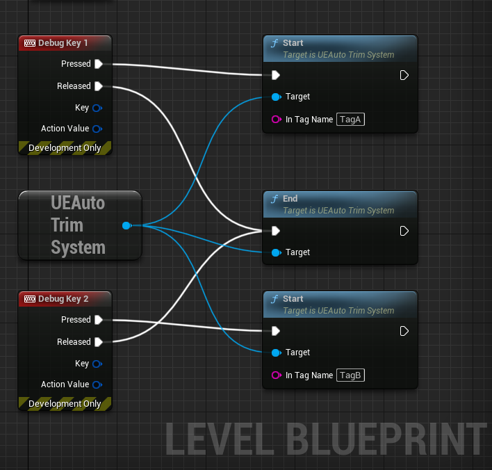

# 概要
キャプチャしたビデオを自動的にトリミングする UnrealEngine 用のツールです。

画面左上に表示されるタグを実装し、そのタグを元に動画を切り取リます。

## 使用例
- キャプチャした動画からプレイヤーのスキルシーを切り取る
- キャプチャした動画から、プレイヤーが敵に倒されたシーンを切り取る

## Demo
もとのキャプチャ動画

https://user-images.githubusercontent.com/103555/233125625-2da462e4-ccc7-4699-991a-c5109564143c.mp4

タグをもとにクリッピングした動画の１つ

https://user-images.githubusercontent.com/103555/233129023-53fa03ed-24f2-4305-9f50-db08587ddc01.mp4

# How to use

1. タグ表示をゲームに実装する 
2. ゲームをプレイして動画キャプチャする 
3. キャプチャ動画を解析する

## 1. タグ表示をゲームに実装する
### 1-1. プラグインを UnrealEngine プロジェクトに追加する
[UEAutoTrim plugin folder](./Plugins/UEAutoTrim/) をプロジェクトのプラグインフォルダにコピーします。  
そして、プラグインをプロジェクトで有効にします。

### 1-2. タグ表示をゲームに実装する

UUEAutoTrimSystemサブシステムを通じて以下の関数を呼び出すことでタグ表示が可能です。

| 関数 | 内容 |
|:-|:-|
|Start|クリップ開始タグ表示|
|End|クリップ終了タグ表示|

実装例



また、タグの表示位置や色を設定する関数も用意されています。詳しくは[UEAutoTrimSystem.h](./Plugins/UEAutoTrim/Source/UEAutoTrim/Public/UEAutoTrimSystem.h)を確認してください。

## 2. ゲームをプレイして動画キャプチャする
ゲームをプレイしWindowsゲームバーなどで動画をキャプチャしてください

## 3. キャプチャ動画を解析する
### 3-1. Dockerイメージを作成
```
docker buildx build -t ue-auto-trim:1.0 .
```

開発環境問題を回避するためにDockerを使用することを推奨します。   
Dockerを使用しない場合は、[Dockerfile](./Dockerfile)を参照し、環境を構築してください。

### 3-2.実行
```
docker run --rm -it  --gpus=all -v {path_to_videodata_dir}:/usr/work:rw  ue-auto-trim:1.0 --video /usr/work/sample.mp4 --dist /usr/work --prefix sample_
```
| 引数 | 詳細 |
|:-|:-|
| --video | ビデオファイルのパス |
| --dist | トリミングファイルdistパス
| --prefix| トリムファイルの接頭辞|
| --detect_frame_scale_x| 検出するフレームのサイズxを決定します。0..1 |
| --detect_frame_scale_y| 検出するフレームのサイズyを決定します。0..1 |
| --trim_offset_sec| タグからトリミング開始位置と終了位置を決定するためのオフセット秒数です。|


**DockerコンテナでGPUを使用するにはNVIDIA Container Toolkitが必要です**  
インストールするには以下を参照してください。  
https://docs.nvidia.com/datacenter/cloud-native/container-toolkit/install-guide.html#docker


**サンプルビデオの使用**  
このリポジトリにはサンプル動画が入っています。  
以下のコマンドを実行するとサンプルビデオを使用してクリッピング処理を確認することができます。

```
cd ue-auto-trim
docker run --rm -it  --gpus=all -v $(pwd)/sampledata:/usr/work:rw ue-auto-trim:1.0 --video /usr/work/sample.mp4 --dist /usr/work --prefix sample_
```
